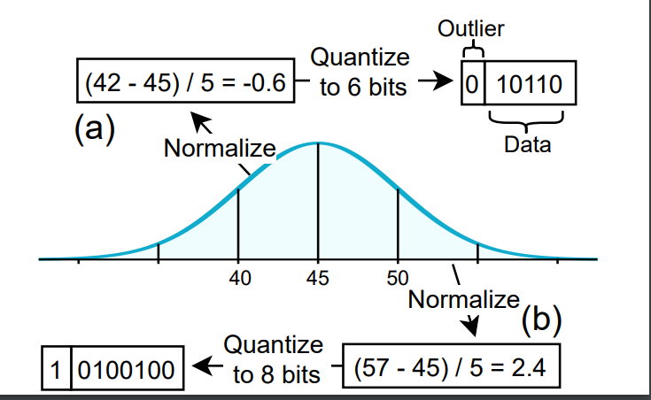
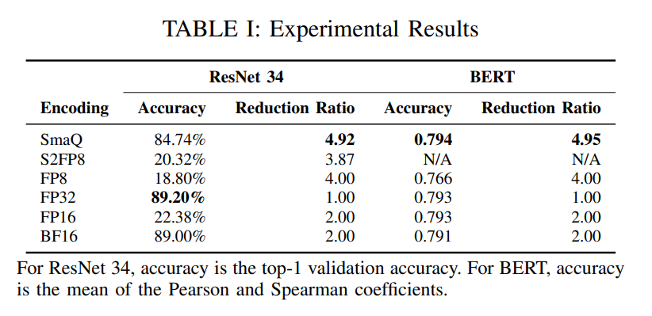
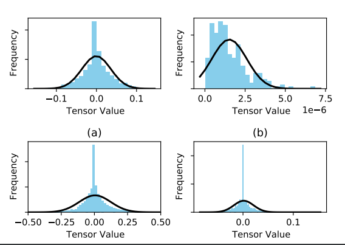

<!-- omit in toc -->
# Smart Quantization (SmaQ)
This repository contains the code for the Smart Quantization paper.

<!-- omit in toc -->
## Table of Contents
- [Introduction](#introduction)
- [Methods Evaluated](#methods-evaluated)
- [Results](#results)
- [Code Stucture and This Repository](#code-stucture-and-this-repository)
  - [Running the Code](#running-the-code)
  - [Supported Data Structures](#supported-data-structures)
  - [Supported Models](#supported-models)
  - [Supported DataSets](#supported-datasets)
  - [Supported Compression/Encoding Methods](#supported-compressionencoding-methods)
  - [Supported Optimizers](#supported-optimizers)
- [Updates](#updates)
- [Journey](#journey)
  - [Base-Delta Immediate for Neural Networks (NNW-BDI)](#base-delta-immediate-for-neural-networks-nnw-bdi)
  - [Smart Quantization](#smart-quantization)

## Introduction
Our investigation into the characteristics of neural network weight, feature map, and gradient distributions for some popular neural network architectures shows that the majority of the data structures used by neural networks can have their value distributions be approximated with normal distributions.

SmaQ is a compression scheme that exploits this observed normal distribution to quantize the data structures. SmaQ calculates the sampled mean and standard deviation of tensors and quantizes each tensor element to 6 or 8 bits based on the z-score of that value. SmaQ is able to reduce the memory usage during training by up to 6.7x with minor losses in accuracy.

The figure below shows a high-level example of this compression method:


## Methods Evaluated
We evalute our method against the following encoding methods:
- FP8
- [Shifted and Squeezed 8-bit Floating Point Format for Low-precision Training of Deep Neural Networks (S2FP8)](https://arxiv.org/pdf/2001.05674.pdf)
- FP16
- [BF16](https://en.wikipedia.org/wiki/Bfloat16_floating-point_format)
- FP32

## Results
The following tables show the performance of our method. For these experiments, we train ResNet 34 and BERT while applying the inaccuracy due to compression and decompression. The results are shown below. Note that the reduction ratio is defined as the ratio of bit-length reduction from the 32
bit baseline: $32/N$.


## Code Stucture and This Repository
This repository implements a **general** framework for evaluating different lossy compression/encoding techniques during neural network training.

It builds on top of the popular [PyTorch Lightning](https://github.com/PyTorchLightning/pytorch-lightning) framework to create an environment where we can compress all major data structures used during neural network training and inference.

At a high level, our framework compresses and immediately decompresses all major data structures after each use.

### Running the Code
1. Make sure that you have Python, Poetry, and PyTorch installed. With poetry, make sure to run `poetry shell` to open a new shell in your Poetry virtualenv.
2. Clone this repository and run `poetry install` to install our dependencies.
3. To start training, run `python train.py --model MODEL --dataset DATASET --compress COMPRESSION_METHOD`
4. To find all the parameters you can give to our training script, just run `python train.py --help`

Below is an example of fine-tuning BERT on the GPU, using the STSB dataset from GLUE, and compressing using SmaQ with 8 bits allocated to outliers and 6 bits allocated to the rest of the values.
```bash
python ./train.py --accelerator ddp --gpus -1 --model bert --dataset glue --task_name stsb --num_labels 1 --batch_size 10 --val_batch_size 8 --max_epochs 6 --learning_rate 2e-5 --weight_decay 0.01 --epsilon 1e-8 --compress smart --num_bits_main 6 --num_bits_outlier 8
```

### Supported Data Structures
We can compress the following values during neural network training (or inference, if applicable):
- Weights
- Gradients
- Forward pass activation values (also known as feature maps)
- Backward pass activation values (also known as gradient maps)
- Optimizer state:
  -  For SGD, this would be the momentum vectors.
  -  For Adam/AdamW, this would be the exponential moving average of gradient values and the exponential moving average of squared gradient values.

### Supported Models
Currently, the models listed below have been tested, but adding new models is very easy.
- [ResNet 18, ResNet 34, ResNet 50](smart_compress/models/resnet.py)
- [InceptionNet](smart_compress/models/inception.py)
- [BERT](smart_compress/models/bert.py)

To add a new model, you need to:
1. Create a new file in the [smart_compress/models](smart_compress/models) directory.
2. In this file, create a class that extends `BaseModule`. `BaseModule` is a wrapper around PyTorch Lightning's `LightningModule`, so you should code your module the same way that you would a lightning module (see the [PyTorch Lightning docs](https://pytorch-lightning.readthedocs.io/en/latest/)). The only difference is that you do not need to manually set up the `configure_optimizers` method, as we will handle this automatically for you.
3. Edit the [smart_compress/util/train.py](smart_compress/util/train.py) file to add your new model class to the model mapping. For example, if I have added a new model class `MyModel`, I would make the following change:
    ```python
    from smart_compress.models.my_model import MyModel

    parser.add_argument(
        "--model",
        action=mapping_action(
            dict(bert=BertModule,
                 inception=InceptionModule,
                 resnet=ResNetModule,
                 my_model=MyModel)),
        default="resnet",
        help="model name",
        dest="model_cls",
    )
    ```

### Supported DataSets
Currently, the datasets listed below have been tested, but adding new datasets is very easy.
- [IMDB](smart_compress/models/resnet.py)
- [InceptionNet](smart_compress/models/inception.py)
- [BERT](smart_compress/models/bert.py)

To add a new model, you need to:
1. Create a new file in the [smart_compress/data](smart_compress/data) directory.
2. In this file, create a class that extends `LightningDataModule`. You should code your module the same way that you would any other lightning data module (see the [PyTorch Lightning docs](https://pytorch-lightning.readthedocs.io/en/latest/)).
3. Edit the [smart_compress/util/train.py](smart_compress/util/train.py) file to add your new datamodule class to the datamodule mapping. For example, if I have added a new datamodule class `MyData`, I would make the following change:
    ```python
    from smart_compress.data.my_data import MyData

    parser.add_argument(
        "--dataset",
        action=mapping_action(
            dict(
                cifar10=CIFAR10DataModule,
                cifar100=CIFAR100DataModule,
                glue=GLUEDataModule,
                imdb=IMDBDataModule,
                my_data=MyData
            )
        ),
        default="cifar10",
        help="dataset name",
        dest="dataset_cls",
    )
    ```

### Supported Compression/Encoding Methods
Currently, the compression methods listed below are supported. However, adding new compression methods is extremely simple.
- [SmaQ](smart_compress/compress/smart.py)
- [FP8](smart_compress/compress/fp8.py)
- [S2FP8](smart_compress/compress/s2fp8.py)
- [FP16](smart_compress/compress/fp16.py)
- [BF16](smart_compress/compress/bf16.py)
- [FP32](smart_compress/compress/fp32.py)

To add a new compression method, you need to:
1. Create a new file in the [smart_compress/compress](smart_compress/compress) directory.
2. In this file, create a class that extends `CompressionAlgorithmBase`.
   - This class will be instantiated once for each GPU or node.
   - If your compression method needs to store some state over time (e.g., aggregate statistics), you may store state as instance members.
   - The `__call__` method of this new class should perform the compression and decompresison step. In other words, `__call__` takes a tensor as input, compresses that tensor, decompresses the compressed tensor, and returns this decompressed value. This should simulate the accuracy loss of the compression method.
3. Edit the [smart_compress/util/train.py](smart_compress/util/train.py) file to add your new compression class to the compression method mapping. For example, if I have added a new compression class `MyCompress`, I would make the following change:
    ```python
    from smart_compress.compress.my_compress import MyCompress

    parser.add_argument(
        "--compress",
        action=mapping_action(
            dict(bf16=BF16,
                fp8=FP8,
                fp16=FP16,
                fp32=FP32,
                s2fp8=S2FP8,
                smart=SmartFP,
                my_compress=MyCompress)),
        ),
        default="fp32",
        dest="compression_cls",
    )
    ```

### Supported Optimizers
Currently, only SGD, Adam, and AdamW are supported. However, you can extend [the optimizer wrapper class](smart_compress/util/pytorch/optimizer.py) to add support for new optimizers.

## Updates
- **Mar 2021** - Added README.
- **Jan 2021** - Added STSB (GLUE) dataset for BERT.
- **Dec 2020** - Added BERT with the IMDB dataset. Added FP8, FP16, BF16.
- **Nov 2020 - Dec 2020** - Removed PyTorch hooks implementation in favor of direct modifications to the computation graph, where we add dummy nodes used for compression during forward and backward pass, allowing us to compress feature maps as well as gradient maps. We also wrap the PyTorch optimizer, allowing us to compress weights, gradients, and optimizer state
- **Oct 2020** - Added ResNet with CIFAR10 and CIFAR100 datasets. Added S2FP8 implementation.
- **Sep 2020** - Added initial implementation of weight, gradient, and feature map compression using PyTorch forward and backward hooks.
- **Aug 2020** - Created tools for visualizing data distributions of different data structures of neural networks.
- **June 2020** - Submitted MEMSYS 2020 paper for NNW-BDI.
- **May 2020** - Highly parallel Rust implementation of NNW-BDI finished.
- **April 2020** - First simple Python implementation of NNW-BDI, which is very slow.

## Journey
This section explains how we have gotten to this stage of our idea.

### Base-Delta Immediate for Neural Networks (NNW-BDI)
Our journey of neural network memory compression starts with the NNW-BDI mechanism. NNW-BDI attempts to modify the [Base-Delta Immediate Compression method](https://users.ece.cmu.edu/~omutlu/pub/bdi-compression_pact12.pdf), which was originally designed to work with integer data values, to work with neural network weight data. [Please read our paper, accepted into MEMSYS 2020, for more information on NNW-BDI](https://www.memsys.io/wp-content/uploads/2020/10/p356-bersatti.pdf).

NNW-BDI is coded in Rust and uses the [Rayon data parallelism library](https://github.com/rayon-rs/rayon) to heavily parallelize the compression process. This code is included in the [libbdi](libbdi) folder.

### Smart Quantization
While NNW-BDI performed very well during inference, its performance during training was heavily limited by the CPU implementation (as highly parallel as it was).

Therefore, we explored ways of making NNW-BDI more performant and implementing it on the GPU. We initially decided to start with an investigation into the data value distributions of different neural network data structures. Our investigation showed that all of these data structures seem to have most of their values in a small cluster around the mean (akin to the normal distribution). The figure below shows some of these distributions:


As a result of this investigation, we came up with SmaQ. See the [introduction](#introduction) for more information on SmaQ.
